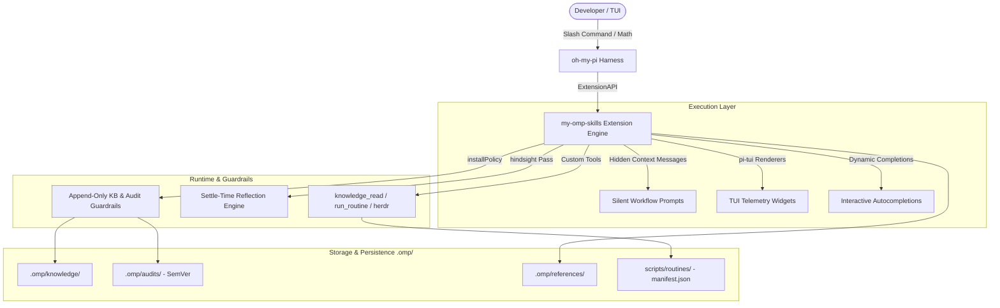

# my-omp-skills

<p align="center">
  
</p>

An extension package for the **oh-my-pi** (omp) agent harness that turns a plain repository into a high-rigor workflow engine. Designed for developers building with `oh-my-pi` plugins and agentic engineering workflows, `my-omp-skills` provides 26 user-invoked slash commands, 12 model-invoked skills, custom TUI telemetry widgets, policy-enforced local storage, and background agent orchestration.

## Overview & Architecture

`my-omp-skills` extends the `oh-my-pi` (omp) agent harness to bring structured engineering discipline to AI pair programming. Rather than relying on unstructured chat or ad-hoc prompting, this package injects deterministic workflow bodies, domain rules, and interactive telemetry directly into session context.



### Core Architectural Components

- **Extension API Integration**: Integrates directly with omp's `ExtensionApi` by registering 26 slash commands, 12 model-invoked skills, policy guardrails (`installPolicy`), custom tools (`knowledge_read`, `run_routine`, `herdr` workspace controls), session start bootstrapping, and settle-time reflection passes (`hindsight`).
- **Silent Workflow Prompt Execution**: Slash commands dispatch heavy workflow markdown instructions, argument substitutions, and companion reference assets as hidden context messages (`display: false`, `attribution: "user"`). The user's TUI prompt stays clean (`/command args`) while the model receives full workflow context.
- **TUI Telemetry & Renderers**: Custom message renderers built on `@oh-my-pi/pi-tui` emit real-time visual cards (`AuditCard`, `TicketBreakdownCard`, `TriageStatusCard`, `ResearchReviewCard`, `ResearchWaveProgressCard`, `ResearchReportPreviewCard`, `ResearchDashboardCard`) into the terminal transcript.
- **Local Persistent Storage**: All domain artifacts—knowledge entries, audit reports, reference clones, and parameterized routine scripts—are stored locally under `.omp/` and `scripts/routines/`, persisting across sessions without remote server dependencies.
- **Always-On LaTeX Math Rendering**: An always-apply rule ensures mathematical formulas, derivations, matrices, and radicals are written as valid LaTeX (`$…$`, `$$…$$`, `\begin{aligned}`), rendered natively by the oh-my-pi TUI.

## Quick Install

Requires an SSH key with access to the private repository. Latest release: **v0.26.0**.

1. **Install pinned release v0.26.0**:

   ```bash
   omp plugin install git+ssh://git@github.com/hae-banko/my-omp-skills.git#v0.26.0
   ```

2. **Maximum Immutability (Commit SHA)**:

   ```bash
   omp plugin install git@github.com:hae-banko/my-omp-skills.git#<full-sha>
   ```

3. **Activate Plugin**:
   Exit and re-enter `omp`. Commands, skills, rules, and tools are discovered at session start.

4. **Initialize Repository Setup**:
   On your first session in a repository, run `/omp-setup` to configure the issue tracker (local `.scratch/` by default; GitHub/GitLab supported), triage label vocabulary, and domain document layout:

   ```bash
   /omp-setup
   ```
   Run `/omp-setup` once per repository—it is safe, idempotent, and does not need re-running after plugin updates.

> **Development Mode**: Track `main` with unpinned install (`omp plugin install git@github.com:hae-banko/my-omp-skills.git`) or link a local working copy (`omp plugin link /path/to/my-omp-skills`).

## Feature Highlights

### Telemetry Widgets
Visual feedback cards built on `@oh-my-pi/pi-tui` render real-time progress and structured state directly in the terminal transcript:
- **`AuditCard`**: Renders audit slug, Semantic Versioning state, overview report path, subtopic counts, and revision status (`customType: "audit-card"`).
- **`TicketBreakdownCard`**: Visualizes spec tracer-bullet ticket breakdowns, execution status, dependency graphs, and blocking edges (`customType: "ticket-breakdown"`).
- **`TriageStatusCard`**: Displays issue and PR triage state machines, category distribution, and verification status (`customType: "triage-status"`).
- **`ResearchReviewCard`**: Renders the TUI Research Review Window displaying field frameworks, item counts, execution scale, and strategy modules (`customType: "research-review"`).
- **`ResearchWaveProgressCard`**: Displays parallel agent OODA wave execution progress, active background workers, and item settlement (`customType: "research-wave-progress"`).

### Deep Research OODA Waves
The `/research` family runs multi-agent investigation using feedback-driven Observe → Orient → Decide → Act (OODA) waves:
- **Phase 1 (Outline & Review)**: Synthesizes `outline.yaml`, `fields.yaml`, and living `research.md`, emitting `ResearchReviewCard`.
- **Phase 2 (Parallel OODA Execution)**: Spawns background agents across strategy search modules (`academic-papers`, `github-debug`, `stackoverflow`, `general-web`, `chinese-tech`). Adjust concurrency via presets (`small`: 1–2 agents, `medium`: 3–5 agents, `high`: max agents). Runs automatically without per-wave prompts (`--approve-each` opt-in). Uses `validate_json.py` to enforce strict schema validation and track `_attempts` provenance across waves.
- **Phase 3 (Report Compilation)**: Converts item JSON files into a structured markdown report with Table of Contents and `_attempts` audit trails for unresolved fields.

### SemVer Audits
Independent critical evaluation of codebase areas, architectures, or proposals written to `.omp/audits/<slug>/`:
- Structured 7-section reports (`overview.md`, legacy fallback `report.md`, and optional `subtopics/*.md` breakdowns).
- Enforces strict Semantic Versioning (`vX.Y.Z`) lineage for revisions (Patch for clarifications, Minor for expanded scope, Major for fundamental conclusions rewrite).
- Protected by policy guardrails (`installPolicy`): past reports and historical archives (`archive/vX.Y.Z.md`) cannot be arbitrarily overwritten or deleted without controlled SemVer frontmatter bumps and revision log entries.

### Knowledge Base
An append-only, timestamped, indexed store located at `.omp/knowledge/`:
- `/record` captures lessons, architectural findings, and audit notes.
- `/pitfall` instantly captures unexpected failures mid-task before context fades.
- Policy enforcement (`installPolicy`) blocks in-place modification of `records/`, `pitfalls/`, and `INDEX.md`, preserving historical integrity.
- The model queries past findings on demand via the model-invoked `knowledge_read` tool.

### Routines Automation
`/routinize` converts repeated ad-hoc workflows into canonical, parameterized scripts under `scripts/routines/`:
- Registered in `scripts/routines/manifest.json` with strict parameter schemas.
- Pre-flight syntax validation with `bash -n` before saving.
- Model executes registered routines via the `run_routine` tool with visual execution cards.
- Subcommands include `/routinize scan`, `/routinize run <id>`, and `/routinize list`.

### Hindsight Reflection
Toggleable settle-time reflection pass (`/hindsight`):
- Runs a hidden pass after turns that execute real work, allowing the model to reconsider design-level choices before settling.
- Configurable via `~/.omp/hindsight.json` to customize reflection prompts (`nudge`), lead-in text, and receipt notifications.

## Complete Command Directory

All 26 commands are user-invoked slash commands. The model knows them at session start and will suggest the right command when appropriate.

| Command | Description | Workflow Phase |
| --- | --- | --- |
| **Plan & Decide** | | |
| `/ask-me` | Router over this package; suggests the command or flow that fits your situation | Plan & Decide |
| `/grill-me` | Relentless one-question-at-a-time interview to sharpen a plan or design before building | Plan & Decide |
| `/grill-with-docs` | Interactive grilling session that also records domain docs (glossary, ADRs) as decisions resolve | Plan & Decide |
| `/wayfinder` | Maps multi-session projects into decision tickets on the tracker, resolved one at a time | Plan & Decide |
| `/improve-codebase-architecture` | Scans codebase for deepening opportunities, presents an HTML report, then grills the chosen target | Plan & Decide |
| **Ship & Build** | | |
| `/to-spec` | Synthesizes current conversation context into a formal spec published to the configured tracker | Ship & Build |
| `/to-tickets` | Breaks a spec or plan into tracer-bullet tickets with explicit blocking edges on the tracker | Ship & Build |
| `/implement` | Builds work described by tickets/specs, driving TDD at pre-agreed seams and closing with code-review | Ship & Build |
| `/triage` | Moves issues and PRs through triage roles into agent-ready briefs (`--unlabeled`, `--needs-triage`) | Ship & Build |
| **Audit & Inspect** | | |
| `/audit` | Independent audit of a codebase area/architecture written to `.omp/audits/<slug>/` with SemVer lineage | Audit & Inspect |
| **Deep Research** | | |
| `/research` | Phase 1: Drafts research outline, field framework, `research.md`, and emits `ResearchReviewCard` | Deep Research |
| `/research-add-items` | Adds research items to existing `outline.yaml` and updates living `research.md` | Deep Research |
| `/research-add-fields` | Adds field framework definitions to existing `fields.yaml` and updates living `research.md` | Deep Research |
| `/research-deep` | Phase 2: Researches outline items with parallel agents in OODA waves into validated JSON (`small`/`medium`/`high`) | Deep Research |
| `/research-report` | Phase 3: Converts research JSON results into a markdown report with TOC & `_attempts` provenance | Deep Research |
| **Knowledge Base & Upkeep** | | |
| `/record` | Saves a durable lesson, audit, or note to the local knowledge base (`.omp/knowledge/`) | Knowledge & Upkeep |
| `/pitfall` | Captures a fresh mistake into `.omp/knowledge/` mid-task before context fades | Knowledge & Upkeep |
| `/routinize` | Converts repeated ad-hoc work into parameterized scripts (`scripts/routines/manifest.json`) & `run_routine` tool | Knowledge & Upkeep |
| `/reference` | Manages cloned reference material in `.omp/references/` (`add`, `update`, `remove`, `list`) | Knowledge & Upkeep |
| `/omp-setup` | Configures repo setup: issue tracker (local `.scratch/`, GitHub, GitLab), triage labels, domain layout | Knowledge & Upkeep |
| `/hindsight` | Toggles settle-time reflection pass (`on`, `off`, or bare to toggle) | Knowledge & Upkeep |
| `/math` | Explains and demos native LaTeX math rendering ($…$, $$…$$, `\begin{aligned}`) | Knowledge & Upkeep |
| `/omp-handoff` | Compacts current conversation into a handoff document for another agent session | Knowledge & Upkeep |
| `/plugin-issue` | Reports a bug or feature request on this plugin's GitHub repository | Knowledge & Upkeep |
| `/teach` | Teaches a skill or concept over multiple sessions using current directory as a stateful workspace | Knowledge & Upkeep |
| `/writing-great-skills` | Reference for skill writing vocabulary, constraints, and principles | Knowledge & Upkeep |

## Interactive Autocompletions

Commands provide intelligent, context-aware argument completion in the TUI:

| Command | Dynamic Completion Behavior |
| --- | --- |
| `/research` | Offers subcommands (`review`, `add-items`, `add-fields`, `status`, `run`, `off`) and live research project directory slugs from `.omp/knowledge/research/` |
| `/research-deep` | Offers execution presets (`small`, `medium`, `high`) and dated research project slugs (e.g., `small 2026-08-02_demo`) |
| `/research-report` | Offers research project directory slugs from `.omp/knowledge/research/` |
| `/routinize` | Offers subcommands (`scan`, `run <id>`, `list`) and live routine IDs from `manifest.json` and `scripts/routines/` |
| `/reference` | Offers subcommands (`add`, `update`, `remove`, `list`) when empty, and cloned reference names for `update <name>` and `remove <name>` |
| `/triage` | Offers `--unlabeled` and `--needs-triage` flags |
| `/to-tickets` | Offers spec markdown files from `.scratch/specs/` and `docs/specs/` |
| `/record` | Offers `--recent` flag |
| `/pitfall` | Offers `--recent` flag |
| `/hindsight` | Offers subcommands (`on`, `off`, `status`) with live state indicators in descriptions |

## Model-Invoked Skills

The 12 skills are model-invoked: omp loads a skill automatically when the context matches. Exception: `using-git-worktrees` is user-invoked only.

| Skill | Description | Trigger Condition |
| --- | --- | --- |
| `grilling` | Relentless one-question-at-a-time interview until every decision branch resolves. | You have a plan or design worth stress-testing before building. |
| `tdd` | Red-green-refactor test-first loop at pre-agreed seams. | Building a feature or fixing a bug where tests guard the observable contract. |
| `code-review` | Two-axis review (Standards + Spec) of diffs via parallel subagents. | You ask to review a branch, PR, or work-in-progress changes. |
| `diagnosing-bugs` | Disciplined loop: reproduce, minimize, hypothesize, instrument, fix, regression-test. | Something is broken, throwing, failing, or suffering performance regressions. |
| `research` | Background agent investigates high-trust primary sources; findings as cited markdown. | A question needs facts from primary documentation or papers. |
| `prototype` | Throwaway code that answers one design question (logic or UI). | Sanity-checking whether a state model or user interface feels right. |
| `domain-modeling` | Builds and sharpens project domain model; maintains `CONTEXT.md` and ADRs. | Terminology is fuzzy or an architectural decision needs recording. |
| `codebase-design` | Vocabulary for deep modules: hiding complex behavior behind a small interface at a clean seam. | Designing a module's interface or deciding where a seam goes. |
| `resolving-merge-conflicts` | Resolves in-progress merges/rebases by intent, hunk by hunk—never `--abort`. | A merge or rebase is in progress with conflicts. |
| `using-references` | Consults cloned reference corpus before reconstructing external behavior from memory. | Reimplementing algorithms (ODE solvers, dense ML) with an available reference. |
| `using-herdr` | Operates herdr terminal workspace manager (`herdr_layout`/`herdr_pane`/`herdr_agent` tools or CLI). | The user mentions herdr or asks to control workspaces, panes, or sibling agents. |
| `using-git-worktrees` | Isolates feature work in a dedicated git worktree (`.worktrees/` convention). | **User-invoked only**: explicitly requested by user. |

## Developer Contract & Guardrails

To ensure agentic operations remain reliable and non-destructive, `my-omp-skills` enforces three core developer contracts:

1. **Append-Only Knowledge Store**:
   Policy guardrails (`installPolicy`) protect `.omp/knowledge/` records, pitfalls, and `INDEX.md`. Files in these directories can never be rewritten or deleted in place by file tools (`write`, `edit`) or shell commands (`sed`, `mv`, `rm`). Outdated entries are corrected by adding a new timestamped entry rather than mutating past history.
2. **Non-Validating Audit Stance**:
   Audits (`/audit`) mandate an independent, critical stance. The model is forbidden from rubber-stamping code, confirming unverified assumptions, or self-validating flawed designs. Every finding must be backed by concrete codebase evidence, and updates require explicit Semantic Versioning (`vX.Y.Z`) bumps in frontmatter.
3. **Silent Workflow Prompt Execution**:
   Commands dispatch extensive instructions, context schemas, and companion reference assets via hidden context messages (`display: false`, `attribution: "user"`). This eliminates transcript pollution while providing the model with strict, unambiguous execution contracts.

## Hindsight Configuration

Configure `/hindsight` via `~/.omp/hindsight.json`. All fields are optional:

```json
{
  "name": "strict",
  "nudge": "Before settling, re-read your last turn and identify any design-level change that would simplify the approach. Prefer deletion over addition.",
  "leadIn": "Reconsider your last turn in light of the tool results.",
  "onMessage": "Hindsight: on (strict)",
  "offMessage": "Hindsight: off"
}
```

| Field | Type | Purpose |
| --- | --- | --- |
| `name` | string | Human-readable label for this configuration (e.g., `"strict"`, `"exploratory"`). |
| `nudge` | string | The reflection prompt passed to the hidden settle-time pass. |
| `leadIn` | string | Phrase prepended to the model's hidden reasoning during the hindsight pass. |
| `onMessage` | string | Receipt text shown when hindsight is enabled (set to `""` to suppress). |
| `offMessage` | string | Receipt text shown when hindsight is disabled (set to `""` to suppress). |

## Updating & Troubleshooting

All plugin management goes through `omp plugin`:

1. **View Installed Plugins**: `omp plugin list` shows `my-omp-skills@v0.26.0`.
2. **Check Tagged Releases**: `git ls-remote git@github.com:hae-banko/my-omp-skills.git --tags`.
3. **Upgrade Version**: Reinstall pinned to the target release tag:
   ```bash
   omp plugin install git+ssh://git@github.com/hae-banko/my-omp-skills.git#v0.26.0
   ```
4. **Fix Cached Mirror Mismatches**: If Bun's cache predates a new tag:
   ```bash
   git -C ~/.bun/install/cache/958cddb050b6f945.git fetch origin +refs/tags/*:refs/tags/* +refs/heads/main:refs/heads/main
   ```
5. **Uninstall Plugin**: `omp plugin uninstall my-omp-skills`.

## Attribution

Adapted from three open-source suites (all MIT licensed):
- [mattpocock/skills](https://github.com/mattpocock/skills) — Base command and skill structure.
- [obra/superpowers](https://github.com/obra/superpowers) — Source of `using-git-worktrees` skill.
- [Weizhena/deep-research-skills](https://github.com/Weizhena/deep-research-skills) — Source of the `/research` command family.
